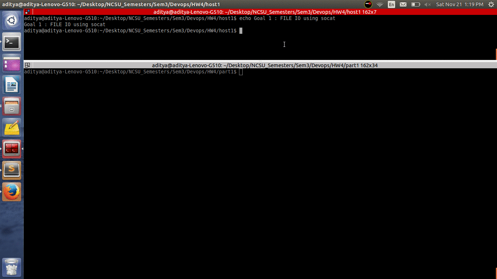
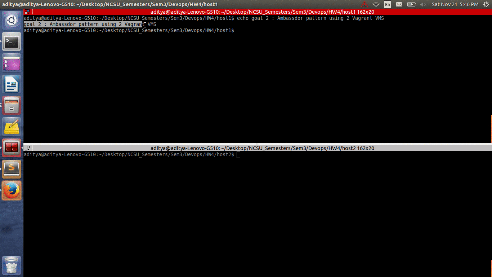

# Homework 4 - Advanced Docker

###Goal 1
**_File IO: To create a container for a legacy application. You succeed, but you need access to a file that the legacy app creates._**

=> To achieve this goal I have created a [DockerFile](scripts/Dockerfile_goal1) which runs the command to create file and using socat , maps the file access over the port 9001.

  To Build and run this docker image ,

    docker build  -t socat_container  . 
    docker run -d --name socket socat_container


Then I linked the created container with the new container which access file data using curl.

    docker run -i -t --rm --link socket:socket tutum/curl sh -c 'curl $SOCKET_PORT_9001_TCP_ADDR:$SOCKET_PORT_9001_TCP_PORT'

Screecast demostrating this goal:



###Goal 2
**_Ambassador pattern: Implement the remote ambassador pattern to encapsulate access to a redis container by a container on a different host._**

=> To achieve this goal using vagrant , I have created following setup:

  - Redis server side VM which spawns two containers using Docker Compose. [docker-compose.yml](scripts/docker-compose1.yml) which creates one redis container and server side ambassador container linked to redis container. 
  
  - Redis client side VM which spawns client side ambassador [docker-compose.yml](scripts/docker-compose2.yml) which linkes to the redis-cli docker instance.

  - To unable networking between server and client side docker instances, we need to make two networking configuration related changes. 
    - Unable public bridge networking in [Vagrantfile](scripts/Vagrantfile)
        ```config.vm.network "public_network"```
    - Add routing entry in iptables to accept the traffic for docker containers on server side.
        ```sudo ip addr add 192.168.0.99/8 dev eth1```

  
  To run this docker image on server/client,

    docker-compose up -d


To verify the redis client setup, link it with client-side ambassador and perform get/set operation.

    docker run -i -t --rm --link redis_ambassador_client:redis relateiq/redis-cli
    

Screecast demostrating this goal:


